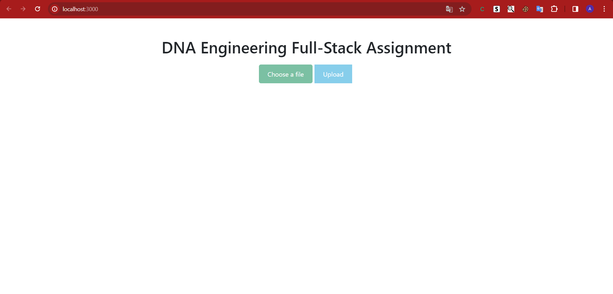
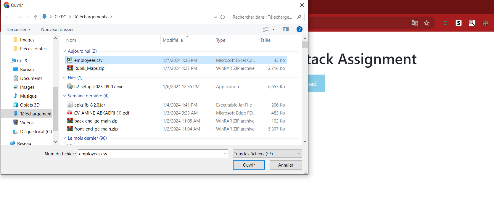
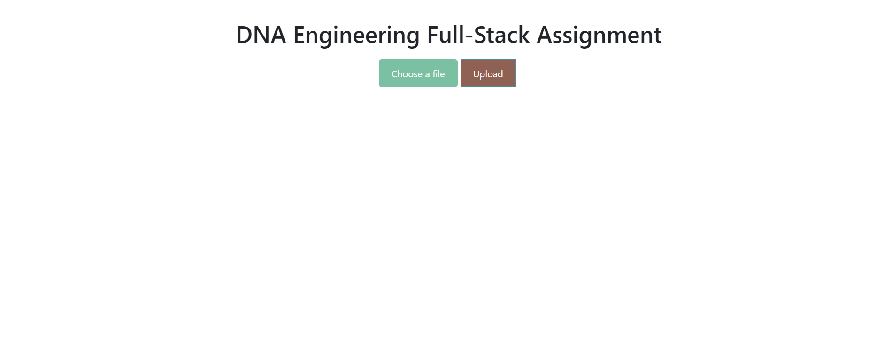
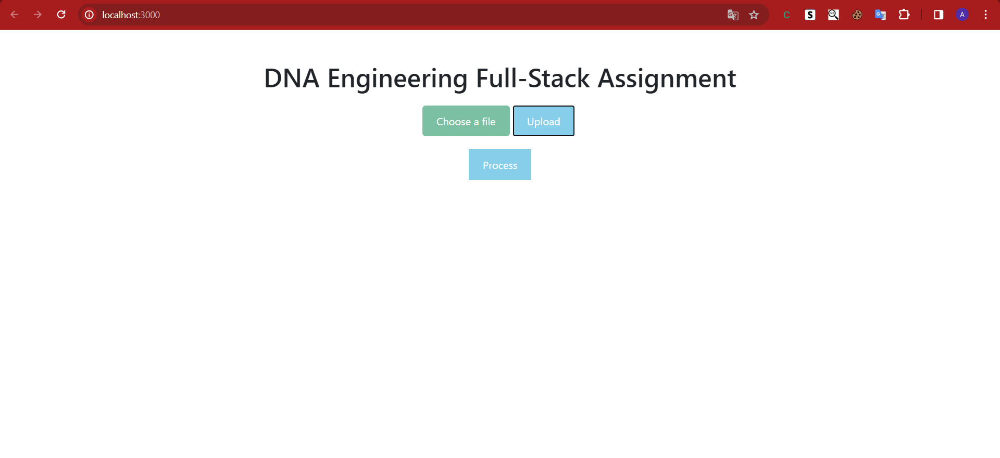
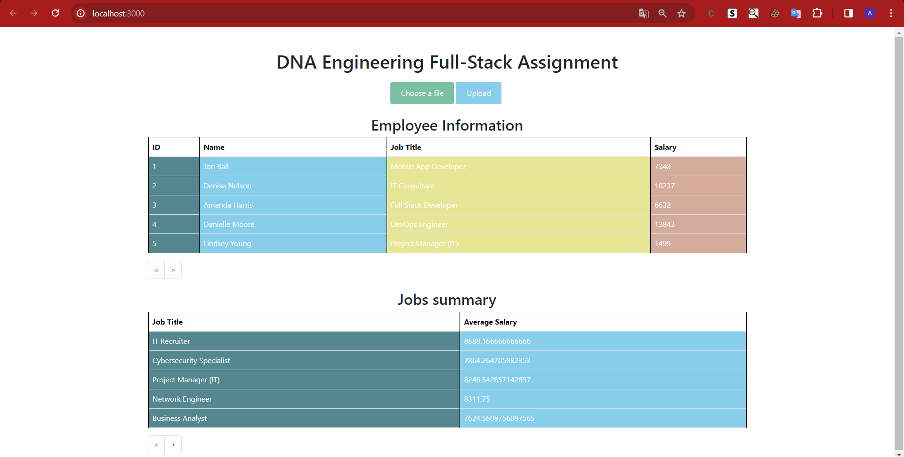

# DNA Engineering Full-Stack Project

This full-stack application manages and displays employee information(CSV Parser), including job titles, salaries, and job summaries. The project is built with Next.js for the front-end and Spring Boot for the back-end.

## Table of Contents
- [Getting Started](#getting-started)
  - [Front-end](#front-end)
  - [Back-end](#back-end)
- [Front-end - Next.js](#front-end-nextjs)
- [Back-end - Spring Boot](#back-end-spring-boot)

## Getting Started

### Front-end

To run the front-end development server:

1. Navigate to the project's root directory in your terminal.
2. Run one of the following commands:

   ```bash
   npm run dev
   # or
   yarn dev
   # or
   pnpm dev
   ```

3. Open [http://localhost:3000](http://localhost:3000) in your browser to access the application.

### Back-end

The back-end is developed using Spring Boot. Follow these steps:

1.Begin by opening the backend directory in your preferred Java Integrated Development Environment (IDE).

2.Ensure that Apache and MySQL are running using XAMPP or another suitable platform.

3.Reload the Maven dependencies for the project.

4.Execute the BackendApplication class to initiate the Spring Boot application.

5.Access the back-end by navigating to http://localhost:8080 in your web browser.

## Front-end - Next.js

### Components

#### `EmployeeTable`

- Displays employee information and job summaries.
- Fetches employee data and average salaries using Axios.
- Implements pagination for a better user experience.

#### `UploadForm`

- Allows users to upload a CSV file containing employee data.
- Uses Axios to send the file to the Spring Boot back-end for processing.

#### `SecondInterface`

- Displays a button to initiate data processing.
- Conditionally renders based on user interactions.

#### `App`

- The main application component managing the overall structure.
- Uses state to control the flow of the application based on user actions.

## Back-end - Spring Boot

### Controller

#### `EmployeeController`

- Manages RESTful API endpoints for employee-related operations.
- Endpoints include fetching all employees, calculating average salaries by job title, parsing CSV files, and importing CSV data.

### Service

#### `CsvParserService`

- Parses CSV files, saves data to the database, and calculates average salaries.
- Uses JPA repository (`EmployeeRepo`) for database operations.

### Entity

#### `Employee`

- Represents an employee with attributes such as ID, name, job title, and salary.

### Repository

#### `EmployeeRepo`

- JPA repository for `Employee` entities.

### Testing

#### `CsvParserServiceTest`

- Unit tests for the `CsvParserService` class.

## Demo
1.First, we select a CSV file to upload.





2.Next, we click on the "Upload" button.



3.Once done, the "Process" button appears. Click on it.



4.The results will then be displayed, illustrated by two arrays: one containing employee information and the other summarizing job details.



## Conclusion

This project demonstrates a full-stack application using Next.js and Spring Boot. The front-end provides a user-friendly interface for managing employee data(CSV Parser), while the back-end handles data processing and storage. Feel free to explore the codebase for more details on the implementation. Contributions and feedback are welcome!

